 

 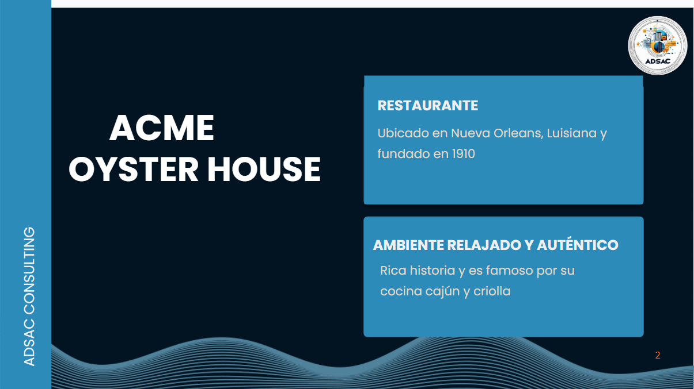

 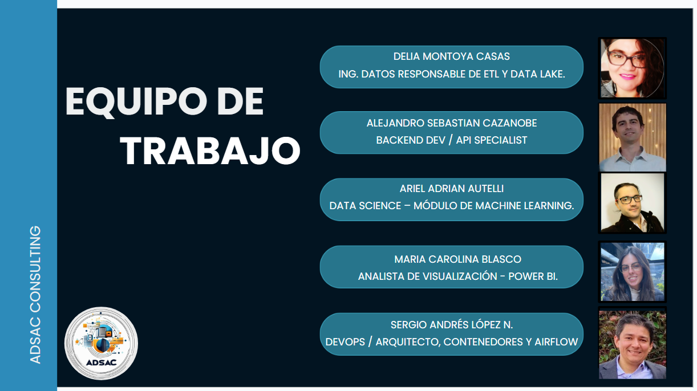

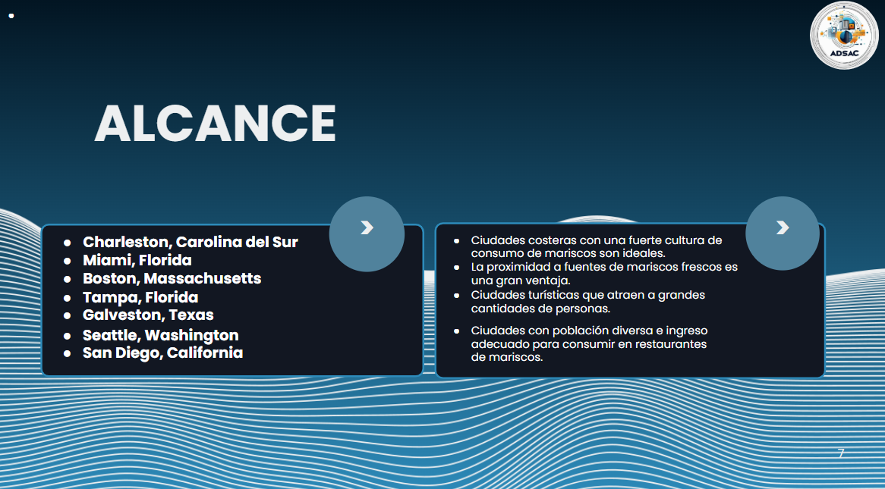

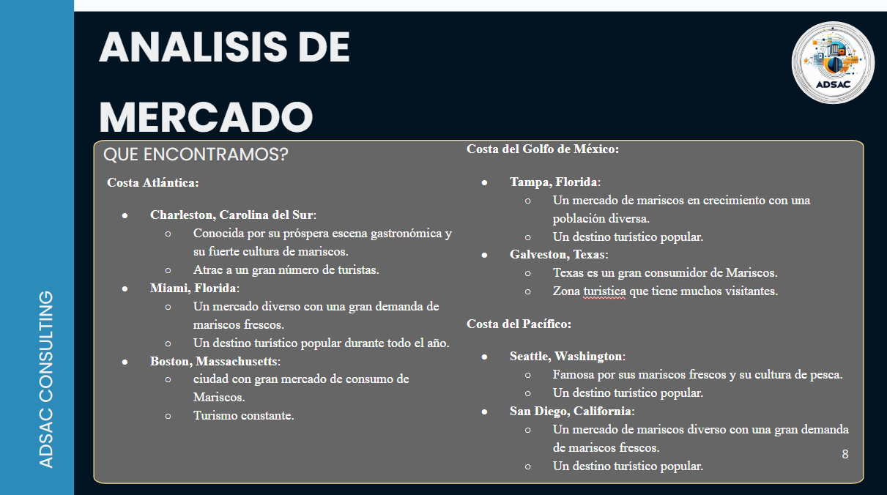

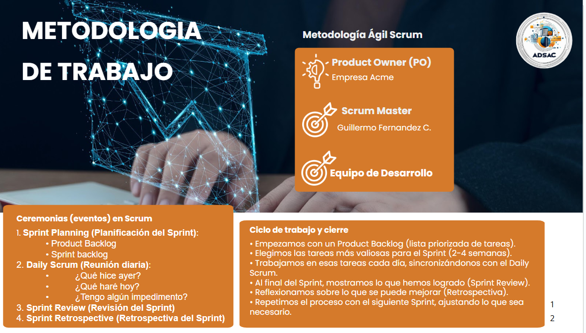

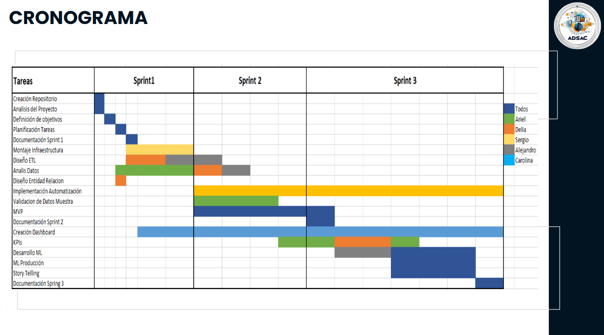

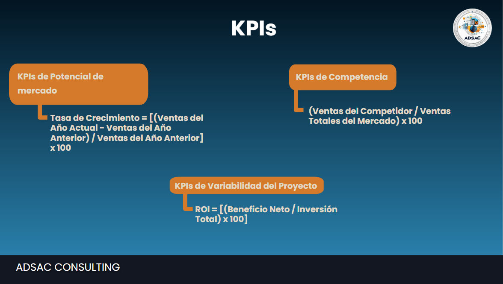

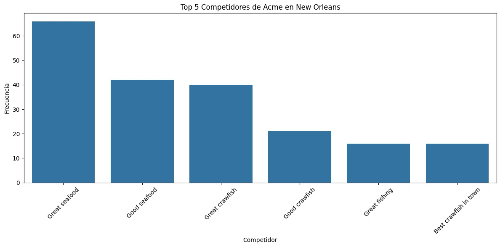

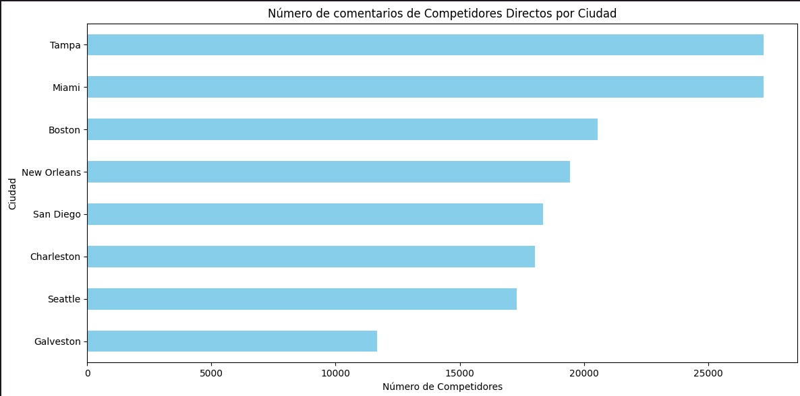

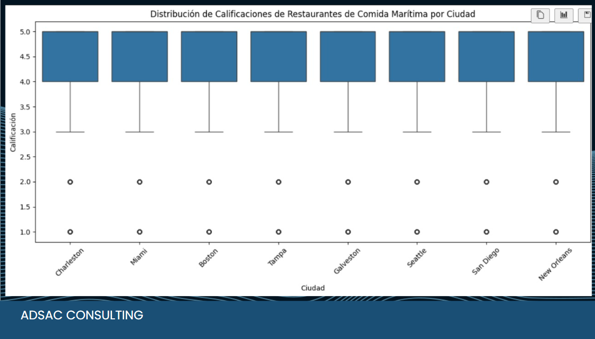

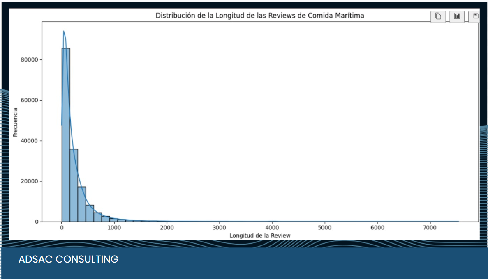

basado en una inversión de 500mil dólares, Rango Alto: $50,000 (depósito + primer mes) + $100,000 (restauración) + $270,000 (cocina) + $20,000 (marketing) + $15,000 (licencias) + $50,000 (materia prima) = $505,000 USD

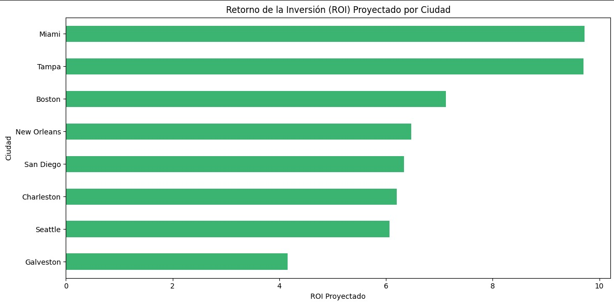

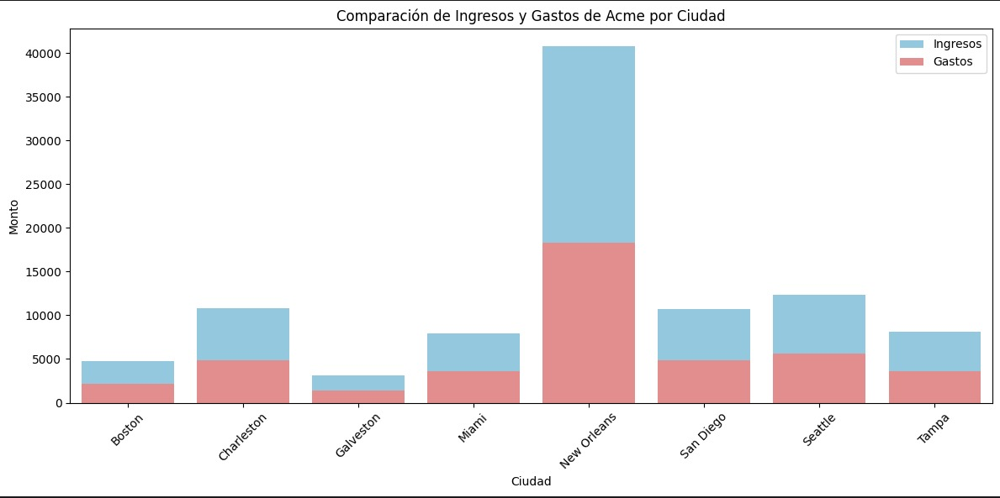


### Stack Tecnologico Automatización
# 📦 Microservicio Carga Incremental - Google Drive ➔ GCS

Este microservicio se encarga de emular una proceso de carga incremental automatizado haciendo uso de Google Cloud Platform (GCP) y la Api de Google Drive con lo cual sincronizamos archivos desde una carpeta compartida en **Google Drive** hacia un bucket en **Google Cloud Storage (GCS)** (proceso para recrear la llegada periodica de archivos, a traves de una API externa, al DataLake del cliente emulado con **Cloud Storage**), registrando toda la trazabilidad en **BigQuery** y programando su ejecucion de forma periodica a través de **Cloud Scheduller**.

## 🔎 Descripción

1. **Recrea** el Data Lake del cliente en Cloud Storage.  
2. **Emula** cargas incrementales desde Google Drive (API) hacia Cloud Storage.  
3. **Orquesta** el flujo mediante eventos de Pub/Sub / Eventarc.  
4. **Procesa** los datos en Cloud Run (microservicios).  
5. **Ingesta** los datos resultantes en BigQuery.  

---

## 🏗️ Arquitectura General

```text
┌─────────────────────┐    ┌────────────────────┐    ┌────────────────────┐
│  Cloud Scheduler    │ →  │  Cloud Run:        │ →  │  Cloud Storage:    │
│  (carga incremental)│     │  carga-incremental │     │  Bucket “acme_storage” │
└─────────────────────┘    └────────────────────┘    └────────────────────┘
                                         │
                                         │  evento `google.storage.object.v1.finalized`
                                         ↓
                              ┌───────────────────────────┐
                              │   Eventarc → Pub/Sub      │
                              └───────────────────────────┘
                                         ↓
                     ┌───────────────────────────────────┐
                     │ Cloud Run: microservicio-compilar-json │
                     └───────────────────────────────────┘
                                         ↓
                              ┌────────────────────┐
                              │  Cloud Storage:    │
                              │  carpeta “Compilados/” │
                              └────────────────────┘
                                         ↓  (otro trigger igual)
                                         ↓
                     ┌───────────────────────────────────┐
                     │ Cloud Run: microservicio-compilar-sitios │
                     └───────────────────────────────────┘
                                         ↓
                              ┌────────────────────┐
                              │  Cloud Storage:    │
                              │  carpeta “Compilados/Sitios/” │
                              └────────────────────┘
                                         ↓
                              evento Pub/Sub & Eventarc
                                         ↓
        ┌────────────────────────────┐        ┌────────────────────────────┐
        │ Cloud Run:                 │        │ Cloud Run:                 │
        │ ingestion-compilados-a-bigquery │      │ ingestion-sitios-a-bigquery │
        └────────────────────────────┘        └────────────────────────────┘
                                         ↓
                                  ┌────────────────┐
                                  │ BigQuery:      │
                                  │ Dataset `Raw_test` │
                                  └────────────────┘


## 🚀 Funcionalidad

1. **Validación y creación** de Datasets y Tablas:
   - Dataset en BigQuery (`Registro_Archivos`).
   - Tablas en BigQuery:
     - `archivos_en_gdrive`
     - `archivos_en_gcs`
     - `archivos_transferidos`
2. **Registro** de archivos detectados en:
   - Carpeta de **Google Drive** (`archivos_en_gdrive`).
   - Carpeta en **GCS** (`archivos_en_gcs`).
3. **Transferencia** de archivos:
   - Archivos que existen en GDrive y no en GCS son descargados y subidos al bucket GCS.
   - Se registra cada transferencia exitosa en `archivos_transferidos`.
4. **Actualización final**:
   - Se vuelve a registrar el estado actualizado de la carpeta GCS para reflejar los archivos realmente existentes.

## 🛠️ Tecnologías y Librerías

- **Google Cloud Storage** (`google-cloud-storage`)
- **Google BigQuery** (`google-cloud-bigquery`)
- **Google API Client** (`google-api-python-client`)
- **Google Authentication Libraries** (`google-auth`, `google-auth-httplib2`, `google-auth-oauthlib`)
- **Python 3.9+**
- **Flask** (opcional para servir en Cloud Run)

## 📄 Variables principales

| Variable         | Descripción                                               |
|------------------|------------------------------------------------------------|
| `PROJECT_ID`      | ID del proyecto en Google Cloud                           |
| `DATASET_ID`      | Dataset en BigQuery para registros                         |
| `TABLE_GDRIVE`    | Tabla que registra archivos encontrados en GDrive          |
| `TABLE_GCS`       | Tabla que registra archivos encontrados en GCS             |
| `TABLE_TRANSFERIDOS` | Tabla que registra archivos transferidos exitosamente  |
| `BUCKET_NAME`     | Nombre del bucket de destino en GCS                        |
| `DESTINATION_FOLDER` | Carpeta destino dentro del bucket en GCS               |
| `FOLDER_ID`       | ID de la carpeta compartida en Google Drive                |

## 📝 Flujo de ejecución (`carga_incremental`)

```plaintext
1. Verifica y crea Dataset y Tablas en BigQuery si no existen.
2. Escanea Google Drive y registra archivos nuevos.
3. Escanea GCS y registra archivos nuevos.
4. Compara archivos de GDrive vs. GCS.
5. Transfiere solo los archivos faltantes.
6. Registra transferencias realizadas.
7. Vuelve a registrar el estado actualizado de GCS.
8. Devuelve respuesta de éxito o error.
```

## 🗂️ Estructura de las Tablas

### `archivos_en_gdrive`
- `gdrive_id` (STRING, REQUIRED)
- `file_name` (STRING)
- `mime_type` (STRING)
- `created_time` (TIMESTAMP)
- `web_view_link` (STRING)

### `archivos_en_gcs`
- `file_name` (STRING, REQUIRED)
- `fecha_creacion` (TIMESTAMP)
- `size_bytes` (INTEGER)
- `mime_type` (STRING)
- `gcs_path` (STRING)

### `archivos_transferidos`
- `file_name` (STRING, REQUIRED)
- `gdrive_id` (STRING, REQUIRED)
- `transfer_time` (TIMESTAMP)
- `gcs_path` (STRING)

## 📋 Instalación de dependencias (requirements.txt)

```plaintext
google-cloud-storage
google-cloud-bigquery
google-api-python-client
google-auth
google-auth-httplib2
google-auth-oauthlib
flask
```

## 📦 Despliegue implementado

Se ha desplegado como servicio en **Cloud Run**, para este caso no se han configurado variables de entorno y los permisos de acceso a los servicios de **Drive**, **GCS**, y **BigQuery** se han proporcionado directamete a través de credenciales en formato .json.

## 📢 Notas importantes

- El microservicio se puede ejecutar múltiples veces y no creara duplicados.
- Ignora carpetas o archivos no descargables (e.g., carpetas o documentos de Google).
- El sistema maneja errores comunes como permisos 403 (`fileNotDownloadable`) sin detener el flujo.


### Stack Tecnologico Para la Base de datos

Se utilizó la nube de google cloud, los componentes usados son:


Cloud Storage: Aqui se almacenan los archivos y  hace la función del data lake
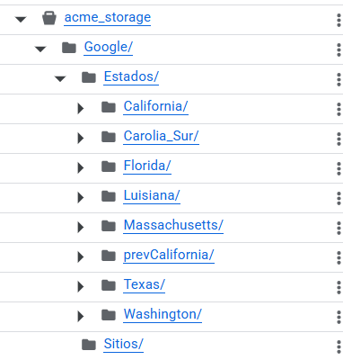

#### Base De Datos

Se utilizó Big Query

A continuación el diagrama entidad relación
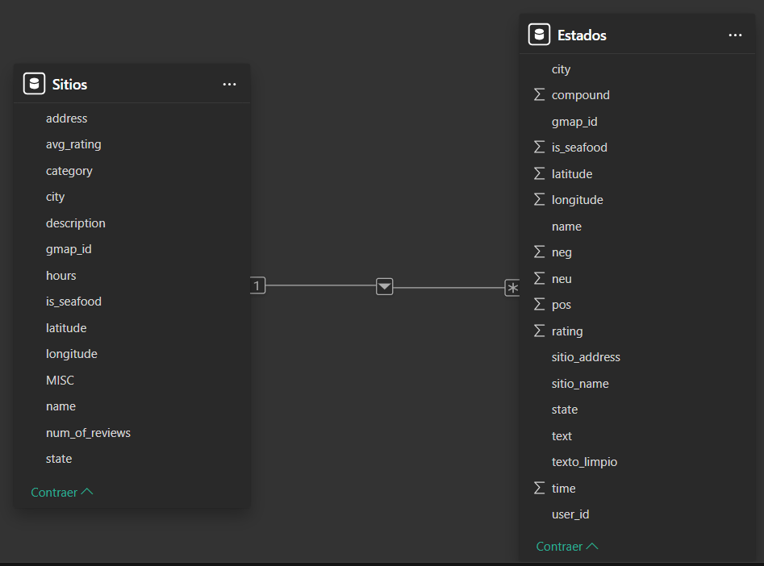

##### Diccionario de datos Google Maps

* Estados

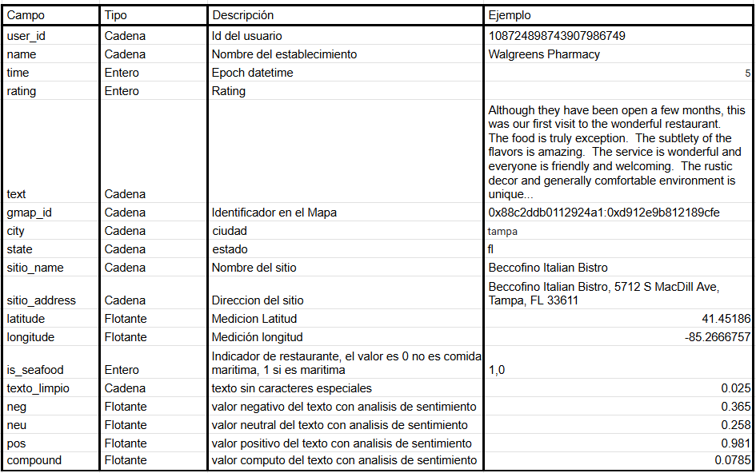

* Sitios

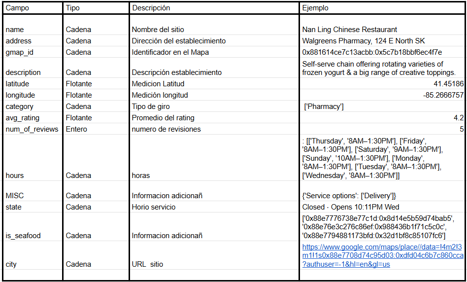

##### ETL

Extrae la información de cloud storage, transforma usando python y la carga a big query. Soporta carga masiva, si el registro ya existe actualiza campos determinados, si no existe lo inserta. El código se encuentra en funcionBigQuery.py

## Stack Técnologico del recomendador y página web

Las herramientas utilizadas son:

- Fast API
- Docker
- Cloud Run
- Flask

A continuación su interacción

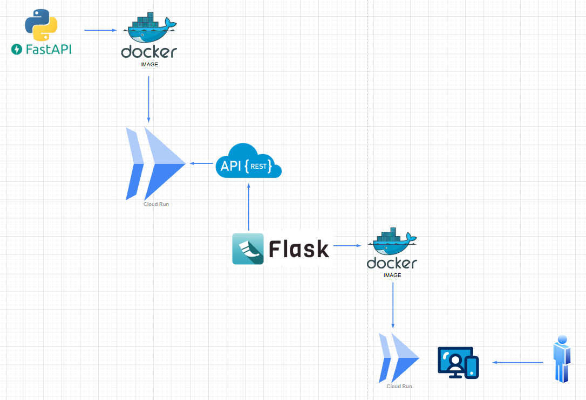

#### Servicio Rest Recomendador 
Esta creado en una imagen de docker en la cual tiene: Fast API: para exponer el servicio del recomendador, recibe como entrada una ciudad y regresa latitud y longitud

##### Librerias Usadas para el recomendador:
RUN pip install fastapi uvicorn
RUN pip install gcsfs
RUN pip install pandas
RUN pip install bigframes
RUN pip install scipy
RUN pip install scikit-learn
RUN pip install geopy

# Modelo de Recomendación de Ubicación para Restaurante de Mariscos

Este readme describe el modelo de recomendación desarrollado para identificar la mejor ubicación para una nueva sucursal de un restaurante de mariscos de nuestro cliente ACME en alguna de las ciudades objetivo de este proyecto. El modelo analiza la densidad de restaurantes en diferentes zonas y la presencia de competidores directos (otros restaurantes de mariscos) para sugerir áreas con alta actividad gastronómica general pero baja competencia en el nicho de mariscos o que la popularidad de esta competencia sea baja.

## Objetivo

El objetivo principal de este modelo es proporcionar una recomendación basada en datos sobre la ubicación más prometedora para una nueva sucursal, maximizando el potencial de éxito al ubicarse en una zona con demanda insatisfecha de restaurantes de mariscos. El resultado principal del modelo es una coordenada de latitud y longitud que representa el centro de la mejor zona identificada.

## Metodología

El modelo sigue los siguientes pasos principales:

1.  **Análisis de Datos Inicial:** Se utilizan datos de Google Maps que contienen información sobre restaurantes, incluyendo su nombre, categoría, ubicación (latitud y longitud), calificaciones, número de reseñas y la ciudad a la que pertenecen.

2.  **Identificación de Restaurantes y Competencia:**
    * Se identifican todos los restaurantes dentro de la ciudad objetivo.
    * Se identifican los restaurantes que son competidores directos, asumiendo que aquellos categorizados como "marisquerías" o similares (a través de la columna `is_seafood`) son la competencia principal.

3.  **Agrupación Espacial (Clustering):**
    * Se utiliza el algoritmo de clustering **DBSCAN (Density-Based Spatial Clustering of Applications with Noise)** para agrupar geográficamente los restaurantes. Esto permite identificar áreas con alta concentración de actividad gastronómica.

4.  **Evaluación de la Competencia por Zona:**
    * Para cada zona identificada (cluster de restaurantes), se cuenta el número de competidores directos (restaurantes de mariscos) presentes en esa área.

5.  **Puntuación de las Zonas:**
    * Se calcula una puntuación para cada zona basándose en varios factores, incluyendo:
        * La cantidad total de restaurantes en la zona (indicador de actividad general).
        * La calificación promedio de los restaurantes en la zona (indicador de calidad general).
        * El número total de reseñas de los restaurantes en la zona (indicador de popularidad general).
        * El número de competidores directos en la zona (indicador de saturación del mercado de mariscos).
    * Las zonas con una alta densidad de restaurantes bien calificados y populares, pero con pocos competidores de mariscos, reciben una puntuación más alta.

6.  **Identificación de la Mejor Zona y su Centroide:**
    * La zona con la puntuación más alta se considera la recomendación principal para la nueva sucursal.
    * El modelo retorna la **latitud y longitud del centroide** de esta mejor zona, representando la ubicación óptima identificada. Esta zona podrá ser visualizada en un mapa en una posterior aplicación web.

## Selección del Modelo

El algoritmo **DBSCAN (Density-Based Spatial Clustering of Applications with Noise)** fue seleccionado como el modelo de clustering espacial por las siguientes razones:

* **No requiere especificar el número de clusters por adelantado:** A diferencia de algoritmos como K-Means, DBSCAN puede descubrir automáticamente la forma y el número de clusters basados en la densidad de los datos. Esto es útil ya que no tenemos un conocimiento previo del número óptimo de zonas de alta actividad gastronómica.
* **Identifica clusters de formas arbitrarias:** Los restaurantes no necesariamente se agrupan en formas circulares. DBSCAN puede encontrar clusters de formas irregulares, lo que es más realista para la distribución de negocios en una ciudad.
* **Maneja el ruido:** DBSCAN puede identificar puntos de datos que no pertenecen a ningún cluster (ruido), lo que en este contexto podrían ser restaurantes aislados que no forman parte de una zona de alta densidad.

## Feature Engineering

El proceso de "Feature Engineering" (creación y transformación de características) en este modelo incluye:

* **Extracción de Coordenadas:** Se utilizaron directamente las columnas de 'latitude' y 'longitude' como las características principales para el clustering espacial. Estas son representaciones numéricas directas de la ubicación geográfica de cada restaurante.
* **Identificación de Competencia (`is_seafood`):** Se creó una columna booleana (`is_seafood`) para identificar si un restaurante pertenece a la categoría de mariscos. Esta característica es crucial para determinar la competencia directa en cada zona. *Nota: En el código proporcionado, se asume que esta columna ya existe. Si no es así, sería necesario crearla a partir de la columna 'category' buscando palabras clave como "seafood", "mariscos", etc.*
* **Creación de Clusters (`cluster_rest`):** El algoritmo DBSCAN genera una nueva característica: el 'cluster_rest' ID para cada restaurante, indicando a qué grupo geográfico pertenece.
* **Métricas Agregadas por Cluster:** Para evaluar cada zona, se crearon nuevas características agregadas a nivel de cluster, como:
    * `num_restaurantes`: Conteo de restaurantes por cluster.
    * `avg_rating_mean_general`: Promedio de la calificación por cluster.
    * `sum_reviews_general`: Suma de las reseñas por cluster.
    * `num_competidores_en_cluster`: Número de competidores por cluster.
    * `lat_centroide`, `lon_centroide`: Coordenadas del centroide de cada cluster.
* **Puntuación (`puntuacion`):** Se creó una nueva característica que combina varias de las anteriores para evaluar el atractivo de cada zona, favoreciendo áreas con alta actividad y baja competencia.

## Interpretación de los Resultados

El modelo identifica la mejor zona para la nueva sucursal y retorna la latitud y longitud del centroide de esa zona. Esta ubicación representa el punto central del área que presenta la combinación más favorable de alta actividad gastronómica general y baja competencia directa de restaurantes de mariscos. Esta ubicación podrá ser utilizada como punto de referencia para explorar posibles locales en la zona recomendada.


#### Página Web
Flask tiene toda la interacción web y llama al servicio del recomendador a su ves muestra las ubicaciones de los lugares recomendados en un mapa

##### Librerias Usadas para la página WEB
RUN pip install flask gunicorn
RUN pip install requests
RUN pip install folium

#### Caso de uso para acceder al recomendador:

1.- El Usuario/Actor accede al sitio desplegado: https://api2-113694561673.southamerica-east1.run.app/cities
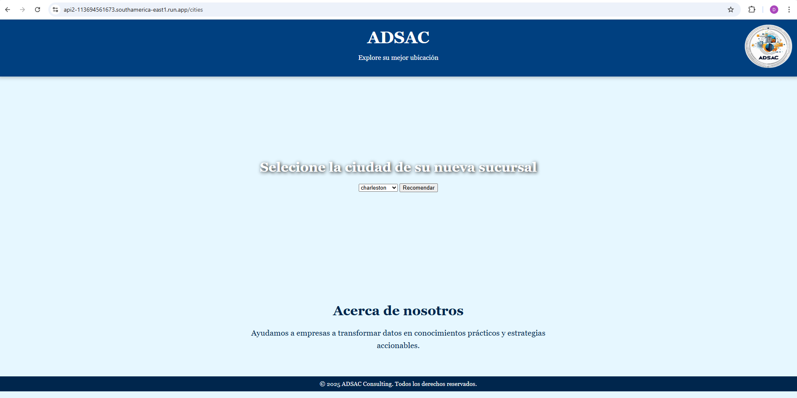

2.- Selecciona una ciudad y da clic en Recomendar


3.- El recomendador regresara mostrando un mapa como a continuación:
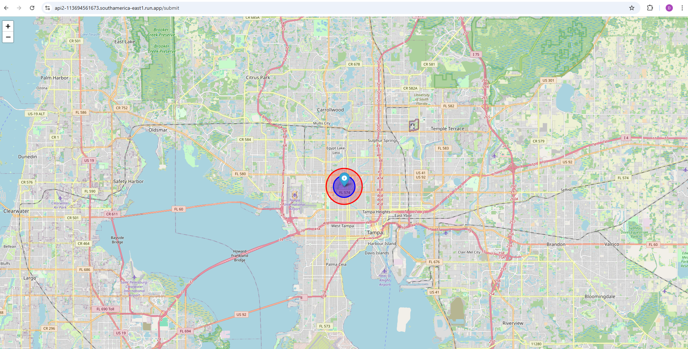


##### Pasos requeridos para crear la imagen y subirla a GCP

1.- Instalar Docker

2.- Crear un archivo dockerfile, como el de a continuación
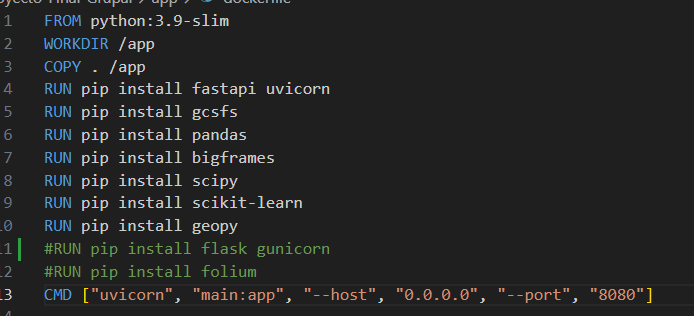

Los pasos siguientes ejecutarlos en un power shell o línea de comandos de windows

3.- Construir la imagen con el siguiente comnando
        docker build -t my-app .

4.- Ir al directorio app y levantar el docker:
        cd app
        docker run -p 8080:8080 my-app
    
    En este paso la aplicación esta desplegada en el localhost, podemos validarlo entrando a la URL, puerto 8080 por ser de docker

Los pasos siguientes serán sobre google Cloud, por lo cual como pre-requerimiento es tener cuenta de google cloud, los siguientes pasos se hacen desde una terminal de windows de google tools

5.- Iniciar sesión con su usuario de google cloud:
            gcloud auth login

6.- Verificar si en el proyecto en el que esta es el que se requiere, si no cambiarse con el siguiente comando
            gcloud config set project PROJECT_ID

7.- Se necesita taggear la aplicación, use el siguiente comando
            docker tag my-app gcr.io/PROJECT_ID/my-app

8.- Se configura la autenticación GCR
            gcloud auth configure-docker

9.- Se carga la imagen de docker previamente creada en el paso 3, con el siguiente comando
            docker push gcr.io/acme-987654/my-app

10.- Ejecute la siguiente línea de comandos para validar que esta la imagen cargada en el cloud:
            gcloud container images list

11.- Despliegue la aplicación en google cloud con el siguiente comando:

            gcloud run deploy api1 --image gcr.io/acme-987654/my-app --platform managed --region southamerica-east1 --allow-unauthenticated
    
12.- Valide en el cloud


##### Pasos para desplegar fast API dentro de una imagen docker y desplegarla en google cloud cuando no es la primera vez

1.- Construir la imagen con el siguiente comnando
            docker build -t my-app .

2.- Ir al directorio app y levantar el docker:
            cd app
            docker run -p 8080:8080 my-app
    
    En este paso la aplicación esta desplegada en el localhost, podemos validarlo entrando a la URL, puerto 8080 por ser de docker

Los pasos siguientes serán sobre google Cloud, por lo cual como pre-requerimiento es tener cuenta de google cloud, los siguientes pasos se hacen desde una terminal de windows de google tools

3.- Se carga la imagen de docker previamente creada en el paso 3, con el siguiente comando
            docker push gcr.io/acme-987654/my-app

4.- Ejecute la siguiente línea de comandos para validar que esta la imagen cargada en el cloud:
            gcloud container images list


5.- Despliegue la aplicación en google cloud con el siguiente comando:

            gcloud run deploy api1 --image gcr.io/acme-987654/my-app --platform managed --region southamerica-east1 --allow-unauthenticated
    
6.- Valide en el cloud

#### Power BI
Dashboard para el cliente donde va a poder recorrer sus datos de forma facil e interactiva, siempre que necesite.

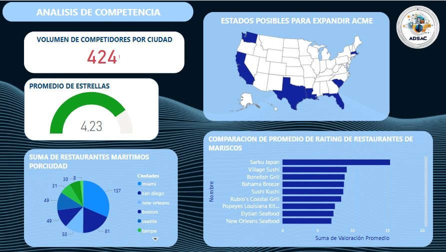

