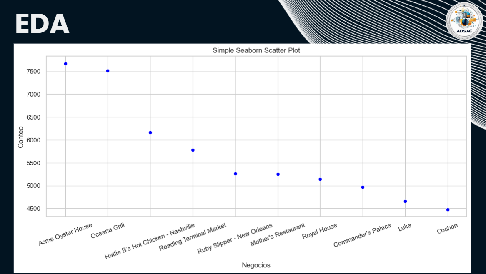
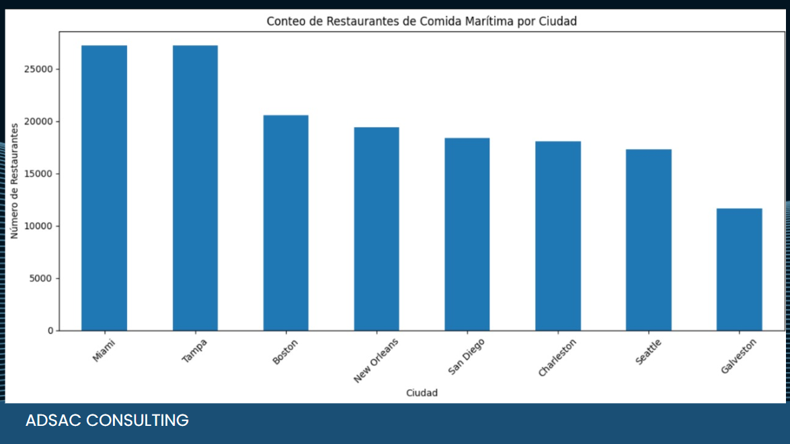
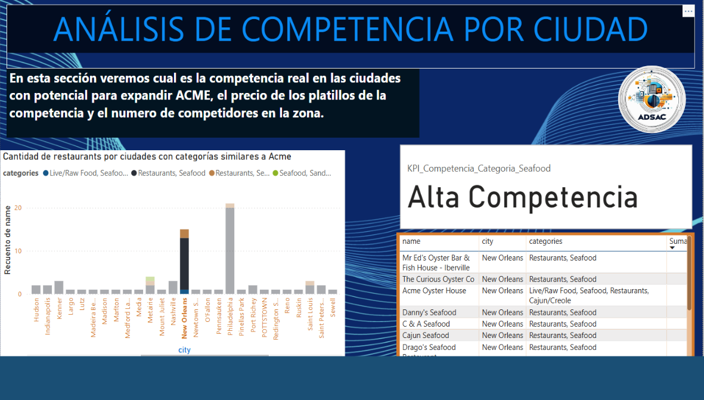
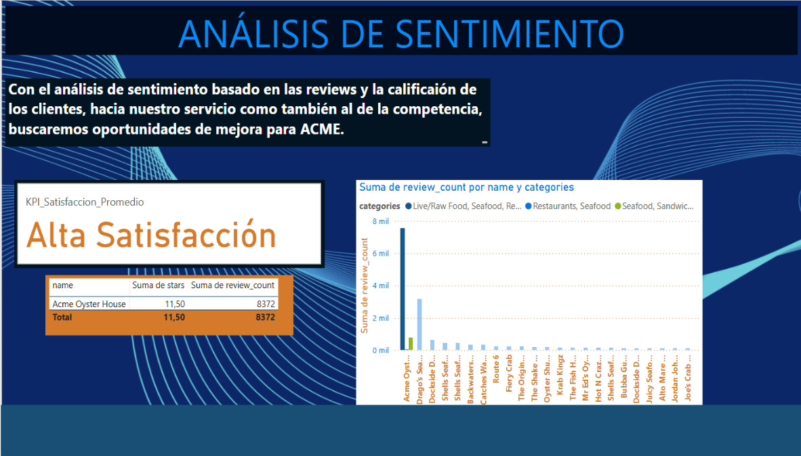

 

 

 

### Stack Tecnologico Para la Base de datos

Se utilizó la nube de google cloud, los componentes usados son:

[Sergio agregar aqui la información]

Cloud Storage: Aqui se almacenan los archivos y  hace la función del data lake

#### Base De Datos

Se utilizó Big Query

A continuación el diagrama entidad relación

##### Diccionario de datos Google Maps

* Estados

* Sitios

##### ETL

Extrae la información de cloud storage, transforma usando python y la carga a big query. Soporta carga masiva, si el registro ya existe actualiza campos determinados, si no existe lo inserta. El código se encuentra en funcionBigQuery.py

## Stack Técnologico del recomendador y página web

Las herramientas utilizadas son:

- Fast API
- Docker
- Cloud Run
- Flask

A continuación su interacción

#### Servicio Rest Recomendador 
Esta creado en una imagen de docker en la cual tiene: Fast API: para exponer el servicio del recomendador, recibe como entrada una ciudad y regresa latitud y longitud

##### Librerias Usadas para el recomendador:
RUN pip install fastapi uvicorn
RUN pip install gcsfs
RUN pip install pandas
RUN pip install bigframes
RUN pip install scipy
RUN pip install scikit-learn
RUN pip install geopy

#### Página Web
Flask tiene toda la interacción web y llama al servicio del recomendador a su ves muestra las ubicaciones de los lugares recomendados en un mapa

##### Librerias Usadas para la página WEB
RUN pip install flask gunicorn
RUN pip install requests
RUN pip install folium

#### Caso de uso para acceder al recomendador:

1.- El Usuario/Actor accede al sitio desplegado: https://api2-113694561673.southamerica-east1.run.app/cities

2.- Selecciona una ciudad y da clic en Recomendar

3.- El recomendador regresara mostrando un mapa como a continuación:

##### Pasos requeridos para crear la imagen y subirla a GCP

1.- Instalar Docker

2.- Crear un archivo dockerfile, como el de a continuación

Los pasos siguientes ejecutarlos en un power shell o línea de comandos de windows

3.- Construir la imagen con el siguiente comnando
        docker build -t my-app .

4.- Ir al directorio app y levantar el docker:
        cd app
        docker run -p 8080:8080 my-app
    
    En este paso la aplicación esta desplegada en el localhost, podemos validarlo entrando a la URL, puerto 8080 por ser de docker

Los pasos siguientes serán sobre google Cloud, por lo cual como pre-requerimiento es tener cuenta de google cloud, los siguientes pasos se hacen desde una terminal de windows de google tools

5.- Iniciar sesión con su usuario de google cloud:
            gcloud auth login

6.- Verificar si en el proyecto en el que esta es el que se requiere, si no cambiarse con el siguiente comando
            gcloud config set project PROJECT_ID

7.- Se necesita taggear la aplicación, use el siguiente comando
            docker tag my-app gcr.io/PROJECT_ID/my-app

8.- Se configura la autenticación GCR
            gcloud auth configure-docker

9.- Se carga la imagen de docker previamente creada en el paso 3, con el siguiente comando
            docker push gcr.io/acme-987654/my-app

10.- Ejecute la siguiente línea de comandos para validar que esta la imagen cargada en el cloud:
            gcloud container images list

11.- Despliegue la aplicación en google cloud con el siguiente comando:

            gcloud run deploy api1 --image gcr.io/acme-987654/my-app --platform managed --region southamerica-east1 --allow-unauthenticated
    
12.- Valide en el cloud

##### Pasos para desplegar fast API dentro de una imagen docker y desplegarla en google cloud cuando no es la primera vez

1.- Construir la imagen con el siguiente comnando
            docker build -t my-app .

2.- Ir al directorio app y levantar el docker:
            cd app
            docker run -p 8080:8080 my-app
    
    En este paso la aplicación esta desplegada en el localhost, podemos validarlo entrando a la URL, puerto 8080 por ser de docker

Los pasos siguientes serán sobre google Cloud, por lo cual como pre-requerimiento es tener cuenta de google cloud, los siguientes pasos se hacen desde una terminal de windows de google tools

3.- Se carga la imagen de docker previamente creada en el paso 3, con el siguiente comando
            docker push gcr.io/acme-987654/my-app

4.- Ejecute la siguiente línea de comandos para validar que esta la imagen cargada en el cloud:
            gcloud container images list

5.- Despliegue la aplicación en google cloud con el siguiente comando:

            gcloud run deploy api1 --image gcr.io/acme-987654/my-app --platform managed --region southamerica-east1 --allow-unauthenticated
    
6.- Valide en el cloud

