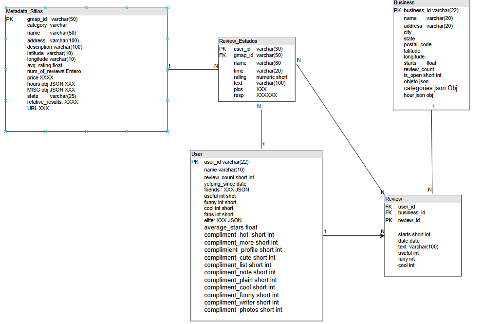
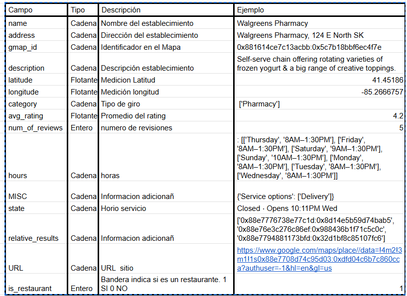
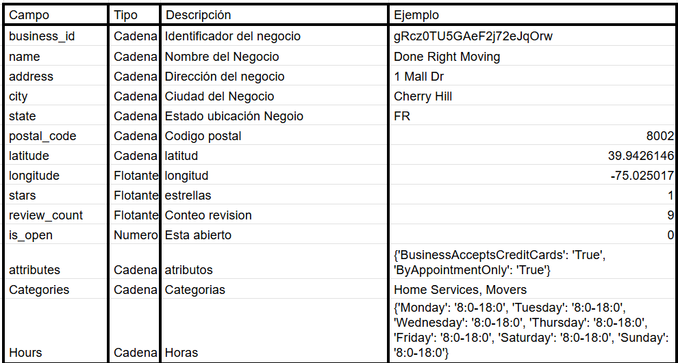
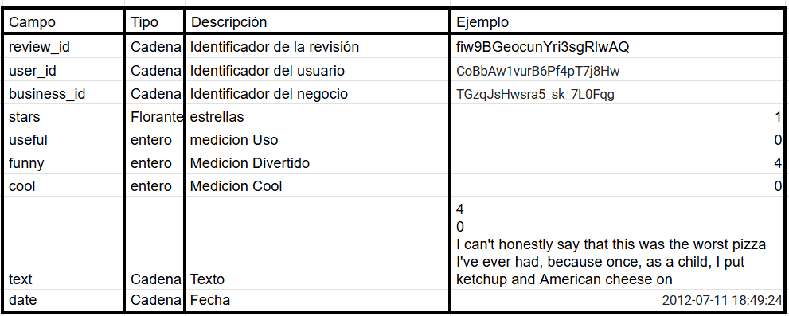
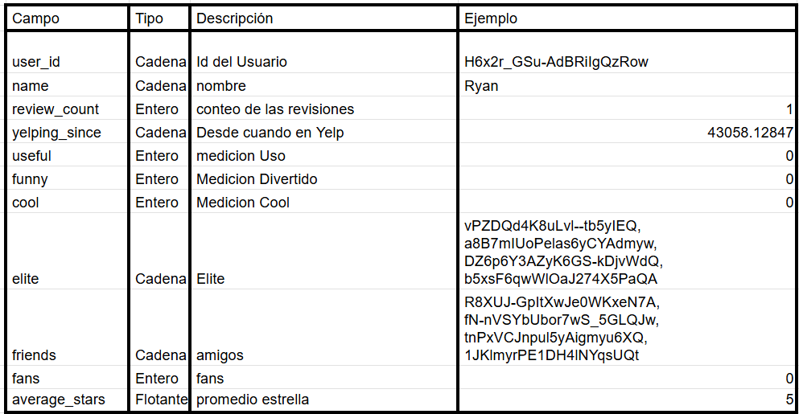
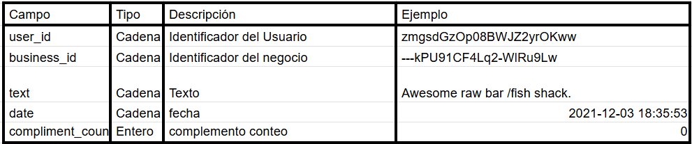
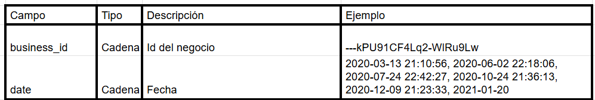

### Stack Tecnologico

Se utilizó la nube de google cloud, los componentes usados son:

Cloud Composer, el cual tiene embebido Airflow y se encarga de la orquestación por medio de DAGs. Para comunicarse entre sus componentes, enlistados a continuación:

Cloud Storage, estaría haciendo la función del data lake, donde se estan almacenando los archivo
A traves de python es como lee el cloud Storage, hace la limpieza y los registros los sube a Big Query.

#### Base De Datos

A continuación el diagrama entidad relación

##### Diccionario de datos

###### Google Maps

* Sitios

* Business

* Review

* Usuario

* Tip

* Check in

