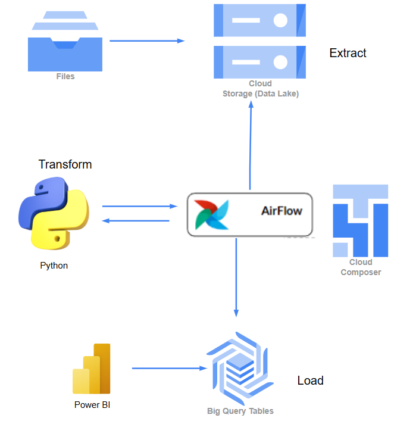

Version de Postgres:

Tareas a Realizar
-   Base de Datos
    -   Definir Que base de datos a Utilizar
    -   Instalación Base de Datos: Propuesta PostgreSQL

-   DataLake    
        -   Definir la organización de la carpeta que contiene los archivos (en zip?)
        -   Planificar la sincronización con el bucket de GSC (si es necesario)

-   Diseño Base de Datos  --> Delia
    -   Creación del Diagrama
        -   Crear tablas
        -   Indices

-   API --> Alejandro
    -   Definir API a utilizar
    -   Definir Integración
    -   Obtención de datos
    -   Guardar Datos
    

-   EDA/ETL
    -   Librerias utilizadas:
            import psycopg2
            from sqlalchemy import create_engine
            import pandas as pd
            import os
            import json
    -   Crear notebook para la limpieza  de los archivos de tipo JSON, PKL, parquet, etc y Filtrado --> Dependemos de Ariel
    -   Cargar los Datos A Base de Datos    --> Dependemos del punto anterior
    

