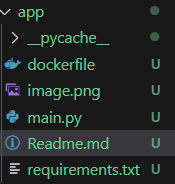
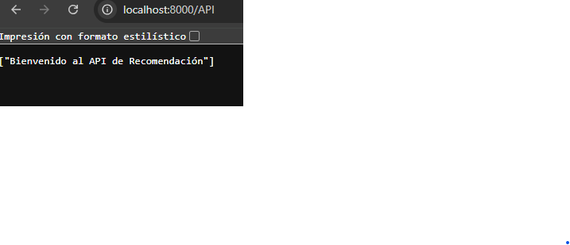
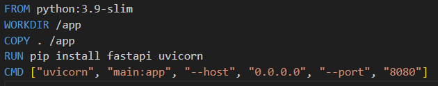
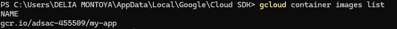
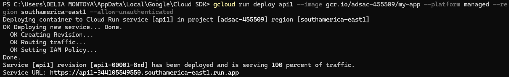
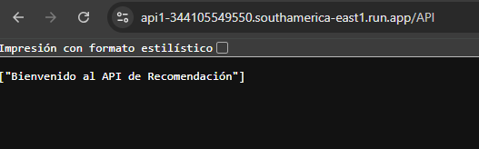

## Pasos para desplegar una aplicación en Cloud Run usando sistema operativo Windows

El proyecto tiene la siguiente estructura:

Pasos previso, el archivo main de fastAPI y funcionando desplegado localmente

##### Pasos para desplegar fast API dentro de una imagen docker y desplegarla en google cloud por primera vez

1.- Instalar Docker

2.- Crear un archivo dockerfile, como el de a continuación

Los pasos siguientes ejecutarlos en un power shell o línea de comandos de windows

3.- Construir la imagen con el siguiente comnando
        docker build -t my-app .

4.- Ir al directorio app y levantar el docker:
        cd app
        docker run -p 8080:8080 my-app
    
    En este paso la aplicación esta desplegada en el localhost, podemos validarlo entrando a la URL, puerto 8080 por ser de docker
    

Los pasos siguientes serán sobre google Cloud, por lo cual como pre-requerimiento es tener cuenta de google cloud, los siguientes pasos se hacen desde una terminal de windows de google tools

5.- Iniciar sesión con su usuario de google cloud:
            gcloud auth login

6.- Verificar si en el proyecto en el que esta es el que se requiere, si no cambiarse con el siguiente comando
         gcloud config set project PROJECT_ID

7.- Se necesita taggear la aplicación, use el siguiente comando
            docker tag my-app gcr.io/PROJECT_ID/my-app

8.- Se configura la autenticación GCR
            gcloud auth configure-docker

9.- Se carga la imagen de docker previamente creada en el paso 3, con el siguiente comando
            docker push gcr.io/adsac-455509/my-app

10.- Ejecute la siguiente línea de comandos para validar que esta la imagen cargada en el cloud:
    

11.- Despliegue la aplicación en google cloud con el siguiente comando:

        gcloud run deploy api1 --image gcr.io/adsac-455509/my-app --platform managed --region southamerica-east1 --allow-unauthenticated
    
    

12.- Valide en el cloud

##### Pasos para desplegar fast API dentro de una imagen docker y desplegarla en google cloud cuando no es la primera vez

1.- Construir la imagen con el siguiente comnando
        docker build -t my-app .

2.- Ir al directorio app y levantar el docker:
        cd app
        docker run -p 8080:8080 my-app
    
    En este paso la aplicación esta desplegada en el localhost, podemos validarlo entrando a la URL, puerto 8080 por ser de docker
    

Los pasos siguientes serán sobre google Cloud, por lo cual como pre-requerimiento es tener cuenta de google cloud, los siguientes pasos se hacen desde una terminal de windows de google tools

3.- Se carga la imagen de docker previamente creada en el paso 3, con el siguiente comando
            docker push gcr.io/adsac-455509/my-app

4.- Ejecute la siguiente línea de comandos para validar que esta la imagen cargada en el cloud:
    

5.- Despliegue la aplicación en google cloud con el siguiente comando:

        gcloud run deploy api1 --image gcr.io/adsac-455509/my-app --platform managed --region southamerica-east1 --allow-unauthenticated
    
    

6.- Valide en el cloud

